**План курса:**

- 8 лекций
- 8 практик
- 1 финальное задание

---

## План

Лекция 1. Строение изображения, разрешение, дискретизация, квантование, выделение границ

Лекция 2. Датасеты, аугментация, метрики в задачах компьютерного зрения

Лекция 3. Свертка, ядра свертки, фильтрация, повышение резкости

Лекция 4. Генерация признаков, операторы

Лекция 5. Конволюционные нейронные сети (CNN)

Лекция 6. CNN для задач сегментации

Лекция 7. CNN для задач задач детектирования

Лекция 8. Трансформеры для задач компьютерного зрения

---

## Что изучает компьютерное зрение?

**Компьютерное зрение (Computer Vision)** — область искусственного интеллекта, которая занимается извлечением информации из изображений и видео.

**Примеры задач:**
- распознавание лиц (производственная безопасность, Face ID и тд)
- автономное вождение (роверы-доставщики, самоуправляемые поезда)
- медицинская диагностика (анализ МРТ, рентгеновских снимков)
- контроль качества на производстве (HSE)
- анализ спутниковых снимков (мониторинг объектов, землепользования)

Для компьютера изображение — это не фотография и не картинка, а набор чисел

Любое цифровое изображение представляет собой дискретный набор пикселей с конечным числом уровней яркости

---

## Основные задачи компьютерного зрения

<br>

1. **Классификация изображений:** «Что изображено на картинке?»

2. **Детекция объектов:** «Где находятся объекты?»

3. **Сегментация:** «Какие пиксели принадлежат объекту?»

4. **Трекинг объектов:** «Как объект перемещается во времени?»

5. **Оценка позы:** Положение человека или объекта

6. **Восстановление 3D:** Получение трехмерной структуры сцены

---

## Примеры производственных задач и проектов

**Сварные швы на производстве**

<div>Качественный сварной шов:</div>
<div>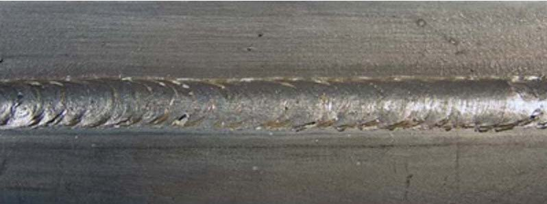</div>

<br><br><br><br><br>
<div>Некондиционный сварной шов:</div>

<div>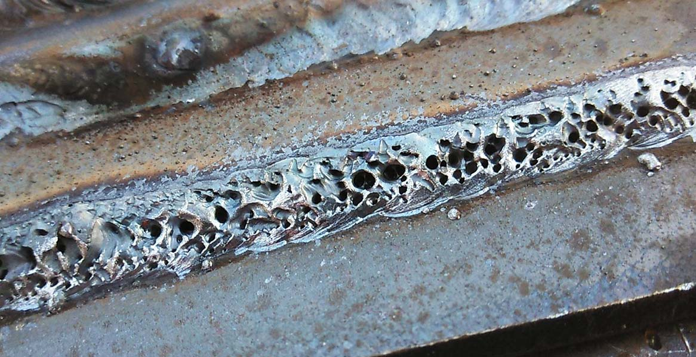</div>

---

## Примеры производственных задач и проектов

**Детекция нефтяных пятен**

<div>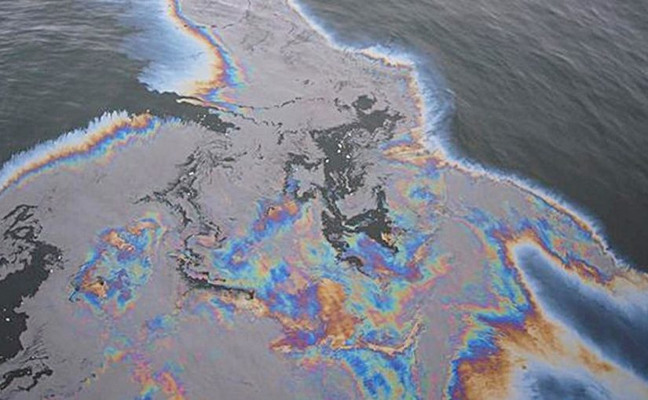</div>

<br>
<br>
<br>
<br>
<br>
<br>
<br>
<br>
<br>
<br>

**Зачем?**
 - выявление новых участков
 - подсчет площади очага

---

## Компьютерное зрение и смежные области

Компьютерное зрение занимается автоматическим анализом визуальных данных.


| Область |	Основная цель |
| --- | --- |
| Обработка изображений | Улучшить изображение |
| Компьютерное зрение | Понять содержание изображения |
| Машинное обучение | Извлечь закономерности из данных |
| Искусственный интеллект | Решать интеллектуальные задачи |

**Историческая справка:**
- 1960–1980: классические алгоритмы
- 1990–2010: признаки и статистические методы
- после 2012: глубокое обучение и CNN

---

## Аналоговое и цифровое изображение

Реальный мир непрерывен. Яркость сцены можно представить функцией:

$$
f(x,y) 
$$

где:

$x,y$ — координаты точки, $f$ — яркость.

<br>

Компьютер не может хранить бесконечно много значений. Поэтому выполняются два шага:

- дискретизация координат
- квантование яркости/интенсивности

В результате получаем цифровое изображение

---

## Пиксель

Пиксель (<u>pic</u>ture <u>el</u>ement) — минимальный элемент цифрового изображения.

Каждый пиксель имеет:

- координаты
- значение яркости

Пример матрицы изображения:

$$
I= \begin{bmatrix} 10 & 20 & 40 \\ 50 & 80 & 100 \\ 120 & 180 & 255 \end{bmatrix} 
$$

Каждое число - яркость пикселя

---

## Изображение как матрица

Черно-белое изображение:

$$
I(x,y) 
$$

представляется матрицей размера

$$
M \times N 
$$

Например:

- 1920×1080
- 1280×720
- 640×480

В компьютерном зрении практически все операции выполняются над матрицами

---

## Цветное изображение

Используется модель RGB:

- red
- green
- blue

Каждый пиксель содержит три числа:

$$
(R,G,B) 
$$

Например:

$$
(255,0,0) \text{ — красный} 
$$

Размер изображения:

$$
M \times N \times 3 
$$

---

## Что такое разрешение?

Разрешение - количество пикселей по горизонтали и вертикали

Пример:

> 1920 × 1080

означает:

> 1920 x 1080 = 2 073 600 пикселей (или \~2.1 Мп)

Чем больше пикселей:

- тем больше деталей
- тем больше память
- тем выше вычислительная сложность

---

## Примеры разрешений

| Название | Разрешение |
| --- | --- |
| VGA | 640×480 |
| HD | 1280×720 |
| Full HD | 1920×1080 |
| 2K | 2560×1440 |
| 4K | 3840×2160 |

---

## Пример потери информации

Представим лицо:

- 1000×1000 пикселей
- затем уменьшаем до 50×50

Исчезают:

- морщины
- текстура кожи
- мелкие детали

Некоторые объекты становятся неразличимыми

---

## DPI vs PPI

Важно различать:

- PPI (Pixels Per Inch) — плотность пикселей на экране.
- DPI (Dots Per Inch) — плотность печати.

В компьютерном зрении работаем с PPI

---

## Дискретизация | Идея дискретизации

Исходная функция яркости:

$$
f(x,y) 
$$

непрерывна.

Компьютер измеряет её только в отдельных точках. Получаем:

$$
f(m,n) 
$$

где

$$
m,n \in \mathbb{Z} 
$$

**Дискретизация** - превращение плавного (аналогового) сигнала в набор отдельных точек (чисел), взятых через равные промежутки времени

---

## Дискретизация | Пример

Пусть есть линия яркости:

> ```
> █████████████ или computer vision!
> ```

После редкой дискретизации:

> ```
> █   █   █   █ или c  p  e  v  i  !
> ```

Информация между точками теряется

**Частота дискретизации**. Чем чаще измеряем изображение:

- тем точнее представление
- тем больше размер данных

---

## Дискретизация | Теорема Найквиста-Шеннона

Чтобы восстановить сигнал без потерь:

> частота дискретизации должна быть минимум в два раза выше максимальной частоты сигнала.

Для изображений это означает:

> мелкие детали требуют высокого разрешения

<br>

### Алиасинг

Если частота дискретизации недостаточна, высокие частоты «превращаются» в ложные низкие частоты, сигнал искажается без возможности восстановления и возникают ложные структуры:
- муар
- «лесенка» на диагональных линиях
- ложные полосы

---

### Алиасинг | пример

<table>
  <tr>
    <td>
      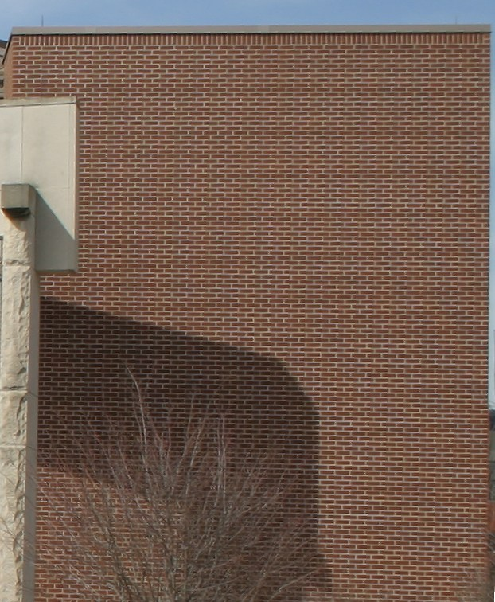
    </td>
    <td>
      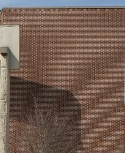
    </td>
  </tr>
</table>


---

## Дискретизация | Способы борьбы с алиасингом

<br>

- увеличение разрешения
- сглаживание перед уменьшением
- специальные алгоритмы антиалиасинга

---

## Квантование | Идея квантования


**Квантование изображений** — это процесс замены непрерывного диапазона значений яркости или цвета на ограниченный набор дискретных уровней

Например:

$$
0 \le I \le 255 
$$

8-битное изображение

Количество уровней:

$$
2^8=256 
$$

Значения:

> 0 ... 255

где

> 0 - чёрный, а 255 - белый

---

## Квантование | Зачем?

<br>

**Зачем нужно квантование:**
- уменьшение объёма данных
- сжатие изображений (JPEG, PNG с ограниченной палитрой)
- ускорение обработки
- уменьшение требований к памяти и каналам передачи данных

---

## Квантование | Примеры

| Глубина | Уровней |
| --- | --- |
| 1 бит | 2 |
| 2 бита | 4 |
| 4 бита | 16 |
| 8 бит | 256 |
| 16 бит | 65536 |

---

## Квантование | Ошибки квантования

Например, если яркость пикселя может принимать любое значение от 0 до 255, то при сильном квантовании можно оставить только 4 уровня:

$$ 0, 85, 170, 255 $$

Тогда все исходные значения будут округляться к ближайшему уровню

<br>

Истинная яркость:

$$
127.7 
$$

После квантования:

$$
170 
$$

Ошибка:

$$
127.7 - 170 = -42.3
$$

---

## Квантование | Визуальный эффект

<br>

**Чем меньше уровней квантования, тем заметнее ошибки:**
- появляются резкие переходы между оттенками (banding, или «полосатость»)
- теряются мелкие детали
- возникают ложные контуры
- ухудшается качество градиентов

---

## Квантование | Визуальный эффект | Пример

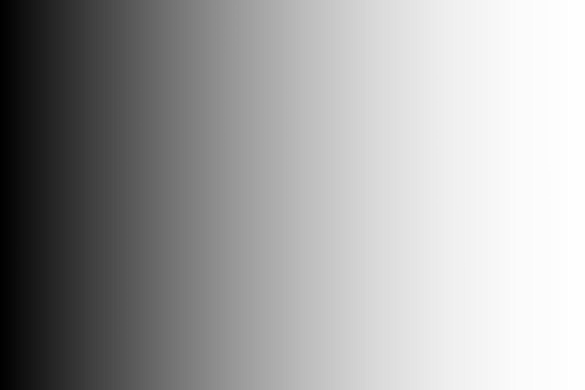

---

## Квантование | Визуальный эффект | Пример

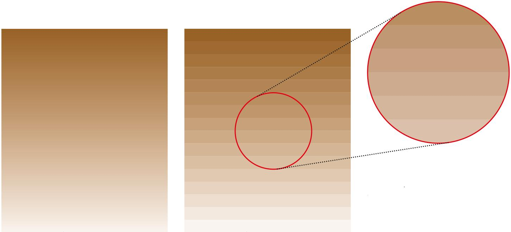

---

## Квантование | Визуальный эффект | Пример

<div style="width:100%;">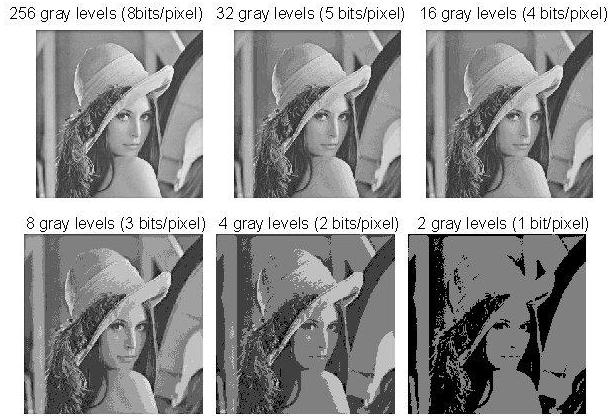</div>

---

## Квантование | Визуальный эффект | Пример

<table>
  <tr>
    <td>
      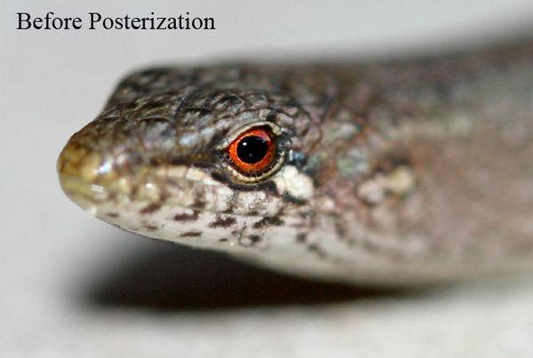
    </td>
    <td>
      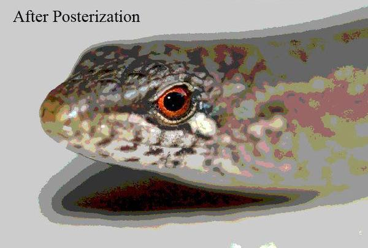
    </td>
  </tr>
</table>


---

## Квантование | Связь с памятью

**Изображение 1920×1080, 8 бит:**

ЧБ версия:

$$
1920 \times 1080 \times 8 = {16\ 588\ 800\ bits} = {2\ 073\ 700\ bytes} \approx \text{1.98\ MB} 
$$

Цветная версия (3 канала):

$$
1920 \times 1080 \times 8 \times 3 = {49\ 766\ 400\ bits} = {6\ 220\ 800\ bytes} \approx \text{5.93\ MB} 
$$

<br>

**Изображение 1920×1080, 24 бит:**

ЧБ версия:

$$
1920 \times 1080 \times 24 = {49\ 766\ 400\ bits} = {6\ 220\ 800\ bytes} \approx \text{5.93\ MB} 
$$

Цветная версия (3 канала):

$$
1920 \times 1080 \times 24 \times 3 = {149\ 299\ 200\ bits} = {18\ 662\ 400\ bytes} \approx \text{17.8\ MB} 
$$

---

## Типичный конвейер компьютерного зрения

Общая схема работы выглядит как:

> <pre>Изображение → Предобработка → Выделение признаков → Модель → Результат</pre>

Пример, фотография кошки:
1. получение изображения
2. изменение размера
3. извлечение признаков
4. классификация
5. Обсуждение

Почему задача сложнее, чем кажется человеку:


---

## Типичный конвейер компьютерного зрения

Общая схема работы выглядит как:

> <pre>Изображение → Предобработка → Выделение признаков → Модель → Результат</pre>

Пример, фотография кошки:
1. получение изображения
2. изменение размера
3. извлечение признаков
4. классификация
5. Обсуждение

Почему задача сложнее, чем кажется человеку:
- освещение
- шум
- ракурсы
- перекрытия объектов

---

## Выделение границ

**Граница** — место резкого изменения яркости

Например:

- контур объекта
- край здания
- граница дороги
- блочное строение залежи на месторождении
- геологический разлом

**Почему границы важны?**

---

## Выделение границ

**Граница** — место резкого изменения яркости

Например:

- контур объекта
- край здания
- граница дороги
- блочное строение залежи на месторождении
- геологический разлом

**Почему границы важны?**

Для человека форма объекта определяется в основном контурами. Поэтому многие алгоритмы сначала ищут границы.

---

## Выделение границ | Примеры

<br>
<br>
<br>

<table>
  <tr>
    <td>
      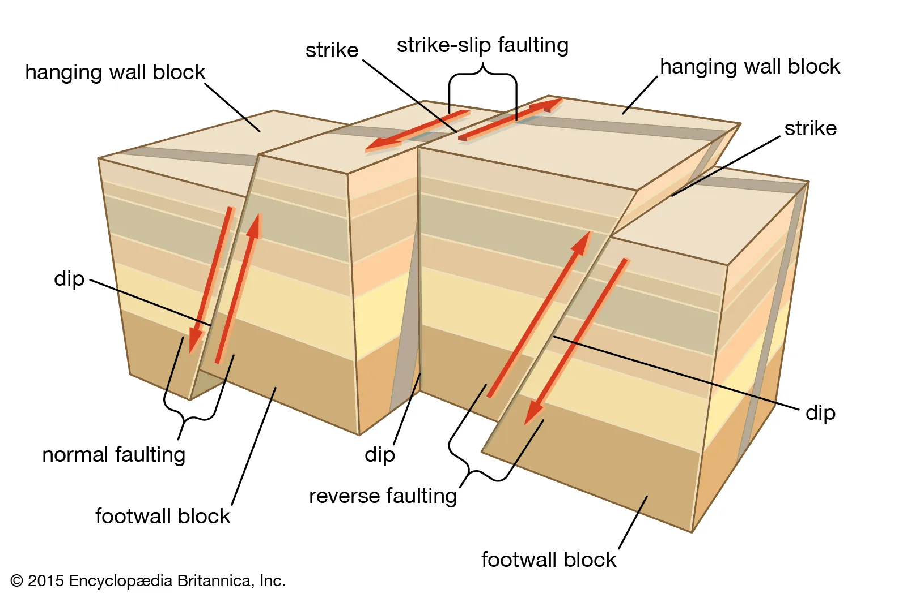
    </td>
    <td>
      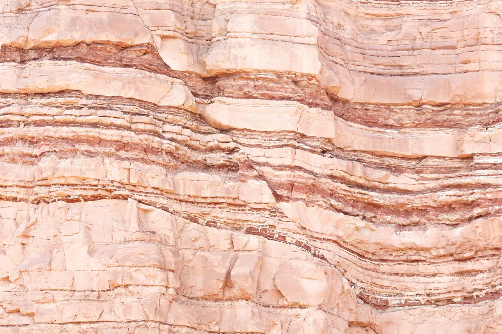
    </td>
  </tr>
</table>

---

## Выделение границ | Производная

Если яркость меняется резко - производная становится большой

Пример:

> ```
> 20 20 20 20 220 220 220
> ```

> ```
> ___________ ‾‾‾‾‾‾‾‾‾‾‾
> ```

Перепад между соседними пикселями большой, значит здесь проходит граница

---

## Выделение границ | Градиент изображения

<br>

Для изображения вычисляются производные:

$$
G_x \text{ - по горизонтали}
$$

$$
G_y \text{ - по вертикали}
$$

Далее:

$$
G= \sqrt{G_x^2+G_y^2} 
$$

Большие значения (G) соответствуют границам

---

## Выделение границ | Оператор Собеля

**Оператор Собеля** - один из самых простых и популярных методов выделения границ

Популярные маски:

$$
S_x= \begin{bmatrix} -1&0&1\\ -2&0&2\\ -1&0&1 \end{bmatrix} 
$$

$$
S_y= \begin{bmatrix} -1&-2&-1\\ 0&0&0\\ 1&2&1 \end{bmatrix} 
$$

Они выделяют горизонтальные и вертикальные перепады яркости

---

## Выделение границ | Алгоритм Canny

Один из самых известных детекторов границ

Этапы:

- сглаживание изображения
- вычисление градиента
- подавление немаксимумов
- двойная пороговая обработка
- трассировка границ

Преимущества:

- мало ложных контуров
- хорошая локализация
- высокая устойчивость к шуму

---

## Выделение границ | Алгоритм Canny

Перед распознаванием:

- дорожных знаков
- документов
- медицинских объектов

Часто сначала выделяют границы перед работой ML пайплайнов, это уменьшает объем данных и подчеркивает форму объектов