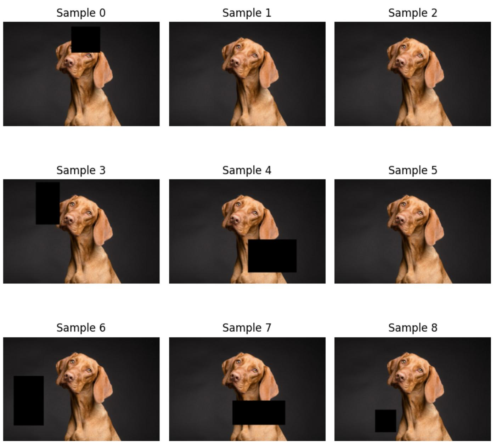
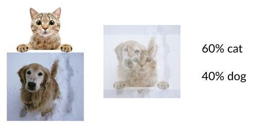
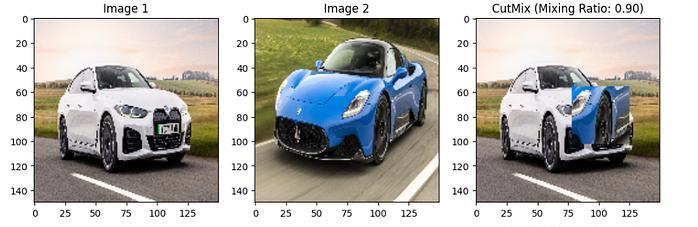
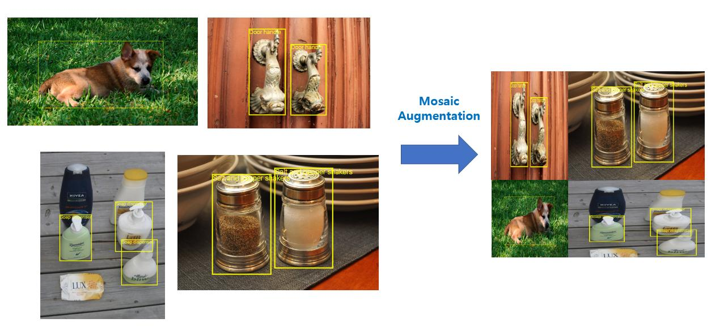
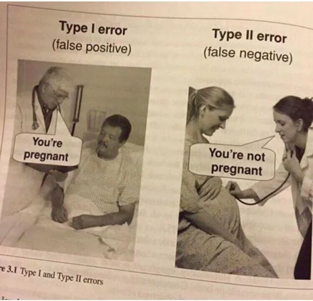
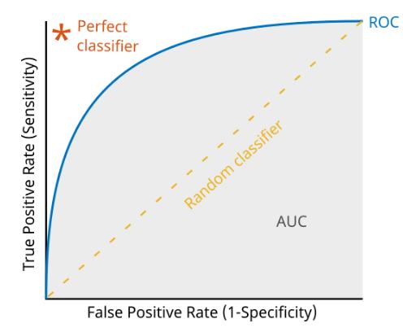
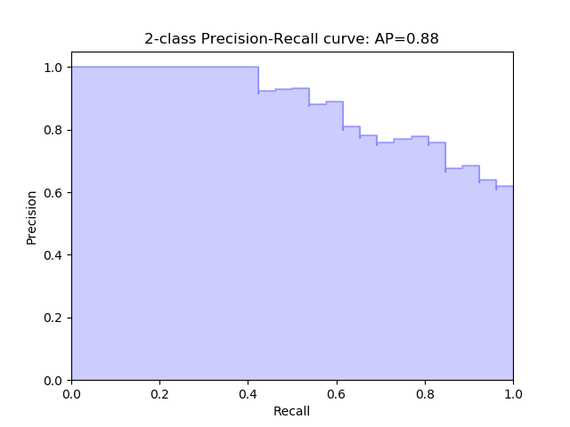

## Формирование и подготовка датасета изображений

---

## Формирование и подготовка датасета изображений

Открытые датасеты

| Dataset | Image size | Train | Val / Test | Задача / Примечания |
| --- | --- | --- | --- | --- |
| [MNIST](https://pytorch.org/vision/stable/generated/torchvision.datasets.MNIST.html) | 28×28 | 60k | 10k | 10 классов, рукописные цифры |
| [CIFAR-10 / CIFAR-100](https://pytorch.org/vision/stable/generated/torchvision.datasets.CIFAR10.html) | 32×32 | 50k | 10k | 10 / 100 классов |
| [ImageNet-1k](https://pytorch.org/vision/stable/generated/torchvision.datasets.ImageNet.html) | varies | ~1.28M | 50k val / 100k test | 1000 классов |
| [COCO 2017](https://pytorch.org/vision/stable/generated/torchvision.datasets.CocoDetection.html) | varies | ~118k | 5k val / 41k test | 80 классов, detection + segmentation + keypoints |
| [Pascal VOC 2012](https://pytorch.org/vision/stable/generated/torchvision.datasets.VOCDetection.html) | varies | ~11k | ~2.9k | 20 классов, detection + segmentation |
| [Open Images v7](https://pytorch.org/vision/stable/generated/torchvision.datasets.OpenImagesDataset.html) | varies | ~9M | 41k val / 125k test | 600 классов |

---

## Open dataset | Pros and cons

<br>

Преимущества:
- большой объем данных
- качественная разметка
- возможность сравнения с научными публикациями

Недостатки:
- могут не соответствовать конкретной задаче

---

## Собственный сбор данных

<br>

Источники:
- камеры и смартфоны
- видеонаблюдение
- промышленное оборудование
- медицинские устройства

Преимущество:
- данные максимально соответствуют реальной задаче

Недостаток:
- дорогостоящая разметка
- возможны систематические ошибки сбора

---

## Собственный сбор данных | Синтетические данные

<br>

Синтетические данные генерируются программно — в 3D-движках или генеративными моделями.

| Инструмент | Применение |
| --- | --- |
| **CARLA** | Симулятор для автономного вождения |
| **BlenderProc** | Рендеринг промышленных сцен с автоматической разметкой |
| **DALL-E / Stable Diffusion** | Генерация обучающих примеров с помощью ИИ |
| **Unity / Unreal Engine** | Произвольные сцены, реалистичный рендеринг |

---

## Собственный сбор данных | Синтетические данные

<br>

Преимущества:
- разметка генерируется автоматически ("условно бесплатно")
- неограниченный объём, контролируемые условия

Ключевая проблема — **domain gap**: синтетические данные отличаются от реальных и модель может плохо обобщаться

Решение: **fine-tuning** на небольшой выборке реальных данных

---

## Инструменты разметки

| Инструмент | Тип разметки | Особенности |
| --- | --- | --- |
| **LabelImg** | BBox | Простой, open-source, Pascal VOC / YOLO |
| **CVAT** | BBox, полигоны, маски, tracking | Мощный, self-hosted или cloud |
| **Label Studio** | Универсальный | Гибкая настройка, multi-modal данные |
| **Roboflow** | BBox, полигоны | Встроенные аугментации, экспорт в разные форматы |
| **SuperAnnotate** | BBox | AI-assisted разметка |

<br>

> **AI-assisted annotation** — модель автоматически предлагает разметку, человек лишь корректирует. Позволяет сократить время разметки

---

## Требования к качеству датасета | Репрезентативность

<br>

Данные должны отражать реальные условия эксплуатации модели

<br>

Если система будет распознавать автомобили на улицах города, в датасете должны присутствовать:

- день и ночь
- дождь и снег
- разные модели автомобилей
- различные ракурсы

---

## Требования к качеству датасета | Баланс классов

<br>

Пример плохого датасета:
- кошки: 10 000 изображений
- собаки: 8 000 изображений
- кролики: 500 изображений

Модель будет плохо распознавать кроликов, поскольку во время обучения видит его значительно реже

## Как исправить?

---

## Требования к качеству датасета | Баланс классов

<br>

Пример плохого датасета:
- кошки: 10 000 изображений
- собаки: 8 000 изображений
- кролики: 500 изображений

Модель будет плохо распознавать кроликов, поскольку во время обучения видит его значительно реже

## Как исправить?

<br>

- добавить больше изображений собак и кроликов
- использовать техники балансировки (oversampling, undersampling)
- применять взвешенные функции потерь

---

## Требования к качеству датасета | Баланс классов | Oversampling

<br>

**Oversampling** — это метод балансировки датасета, при котором примеры редких классов используются чаще, чем примеры распространённых классов

Преимущества:
- Улучшает качество на редких классах
- Не требует изменения архитектуры модели
- Прост в реализации

Недостатки:
- Повышает риск переобучения на редких примерах (для этого нужна аугментация)
- Увеличивает количество повторов одних и тех же изображений
- При сильном дисбалансе может привести к ухудшению качества на частых классах

---

## Требования к качеству датасета | Баланс классов | Undersampling

<br>

**Undersampling** - метод балансировки датасета, при котором количество примеров наиболее представленных классов искусственно сокращается до уровня менее представленных классов

Ранее обсуждаемый датасет:
- кошки: 10 000 изображений
- собаки: 8 000 изображений
- кролики:   500 изображений

Модель, обученная на таком наборе данных, будет отдавать предпочтение классам с большим количеством примеров. Чтобы уменьшить этот эффект, можно выполнить undersampling и сократить число изображений кошек и собак до 500

---

## Требования к качеству датасета | Баланс классов | Undersampling

<br>

Преимущества
- Уменьшает влияние доминирующих классов
- Ускоряет обучение за счет уменьшения объема данных
- Прост в реализации

Недостатки
- Теряется часть данных
- Возможно ухудшение обобщающей способности модели
- При сильном дисбалансе может быть отброшено слишком много полезной информации

---

## Требования к качеству датасета | Баланс классов | Weighted Loss

<br>

Помимо **Oversampling'а** и **Undersampling'а** довольно часто можно встретить взвешивание функции потерь. Каждому классу назначается вес, обратно пропорциональный его частоте встречаемости в обучающей выборке. Ошибки на редких классах получают больший штраф, а на частых - меньший

Общая формула для задачи многоклассовой классификации:

$$ L = - \sum_{i=1}^{N} w_{y_i} \log p_{y_i} $$

где:

$N$ — количество объектов в батче;
$y_i$ — истинный класс объекта;
$p_{y_i}$ — предсказанная вероятность истинного класса;
$w_{y_i}$ — вес соответствующего класса.

---

## Требования к качеству датасета | Баланс классов | Weighted Loss

<br>

Вес класса может вычисляться, например, как:

$$ w_c = \frac{N}{K \cdot n_c} $$

где:

$N$ — общее число объектов в датасете;
$K$ — количество классов;
$n_c$ — количество объектов класса $c$.

Такой подход позволяет повысить чувствительность модели к редким объектам и улучшить сбалансированность метрик качества между классами.


---

## Требования к качеству датасета | Разнообразие данных

Следует учитывать:
- освещение
- масштаб объектов
- фон
- ракурс
- частичные перекрытия объектов

---

## Основные задачи компьютерного зрения

| # | Задача | Описание | Пример |
|---|--------|----------|--------|
| 1 | **Классификация изображений** | Определить, что изображено на картинке | Кошка, собака или машина |
| 2 | Локализация объекта | Найти объект и определить его положение на изображении | Найти автомобиль и построить вокруг него bounding box |
| 3 | **Детекция объектов** | Найти все интересующие объекты и классифицировать каждый | Обнаружить на дороге машины, пешеходов и велосипеды |
| 4 | **Сегментация** | Определить, какие пиксели относятся к каждому объекту или классу | Отделить дорогу, автомобили и пешеходов |
| 5 | Распознавание лиц | Обнаружить лицо и/или определить, кому оно принадлежит | Разблокировка смартфона |

--- 

## Основные задачи компьютерного зрения

| # | Задача | Описание | Пример |
|---|--------|----------|--------|
| 6 | Распознавание текста (OCR) | Извлечь текст из изображения | Прочитать номер автомобиля или отсканированный документ |
| 7 | Оценка позы человека | Определить положение ключевых точек тела | Суставы рук и ног в спортивном приложении |
| 8 | Отслеживание объектов (tracking) | Следить за объектом между кадрами видео | Отслеживать автомобиль на записи с камеры |
| 9 | Генерация и восстановление изображений | Создавать или улучшать изображения | Убрать шум, увеличить разрешение, восстановить повреждённую фотографию |
| ... | и другие ||

---

## Разметка данных

<br>

Тип разметки зависит от задачи:

| **Классификация** | **Детекция объектов** | **Сегментация** |
|---------------|-------------------|-------------|
| Каждое изображение получает один класс | Необходимо указать ограничивающий прямоугольник (bounding box) | Каждому пикселю присваивается класс |
| Пример: <br> - cat.jpg → кошка <br> - dog.jpg → собака | Пример: bounding box вокруг автомобиля: <br> xmin, ymin <br> xmax, ymax | Пример: каждому пикселю дороги присваивается класс: <br> - дорога <br> - автомобиль <br> - пешеход <br> - фон |

---

## Разметка данных | Форматы хранения
 
| Название | Формат | Особенности |
| --- | --- | --- |
| **Pascal VOC** | xml | XML на каждый файл, человекочитаемый |
| **COCO** | json | Один файл на выборку, поддерживает маски |
| **YOLO** | txt | Один .txt на изображение, координаты нормализованы. Формат компактный и простой |
| **LabelMe** | json | Для каждого изображения хранится отдельный JSON-файл. Поддерживаются полигоны, прямоугольники, точки, линии и другие геометрические примитивы |

---

## Разделение выборки

<br>

В целом, как в классических сценариях

| |Train | Validation | Test |
|-- |-------|------------|------|
| Доля | 70–80% | 10–15% | 10–15% |
| Для чего используется | для обучения модели | для оценки качества модели в процессе обучения | только для финальной оценки |

<br>

> **Тестовая выборка не должна использоваться в процессе обучения, нельзя допускать утечку данных**

**Data Leakage** — ситуация, когда модель получает информацию из тестовой выборки.

Финальные метрики окажутся сильно завышенными, если изображения одного пациента попали одновременно в train и test.

--- 

## Разделение выборки | Стратификация и Group Split

<br>

При делении важно сохранять распределение классов в каждой части
 
```python
from sklearn.model_selection import train_test_split
 
# Стратифицированный сплит — распределение классов одинаково в train / val / test
X_train, X_temp, y_train, y_temp = train_test_split(
    images, labels, test_size=0.2, stratify=labels, random_state=42
)
X_val, X_test, y_val, y_test = train_test_split(
    X_temp, y_temp, test_size=0.5, stratify=y_temp, random_state=42
)
```
 
**Group Split** — когда связанные изображения нельзя разделять (например, снимки одного пациента):
 
```python
from sklearn.model_selection import GroupShuffleSplit
 
gss = GroupShuffleSplit(n_splits=1, test_size=0.2, random_state=42)
train_idx, test_idx = next(gss.split(images, labels, groups=patient_ids))
```

---

## Аугментация изображений

<br>

**Аугментация (Data Augmentation)** — искусственное увеличение объема и разнообразия обучающей выборки путем преобразования существующих изображений.

<br>

Основные цели:
- борьба с переобучением
- увеличение устойчивости модели
- имитация реальных условий съемки

---

## Аугментация изображений | Отражение (Flip)

<br>

Горизонтальное:

← →

Вертикальное:

↑ ↓

<br>

Flip используется не всегда

Например, для цифр вертикальное отражение может изменить класс

---

## Аугментация изображений | Поворот (Rotation)

<br>

Поворот (Rotation)

<br>

Обычно:
- ±5°
- ±10°
- ±20°

Слишком большие углы могут ухудшать качество данных

---

## Аугментация изображений | Масштабирование, сдвиг, обрезка

<br>

| **Масштабирование (Scaling)** | **Сдвиг (Translation)** | **Обрезка (Crop)** |
| --- | --- | --- |
| Изменение размера объекта | Смещение изображения по горизонтали и вертикали | Случайное выделение части изображения |
| Позволяет обучить модель работать с различными расстояниями до камеры. | | Помогает модели концентрироваться на важных объектах. |

---

## Аугментация изображений | Цветовые преобразования

<br>

| **Изменение яркости (Brightness)** | **Изменение контраста (Contrast)** | **Изменение насыщенности (Saturation)** | **Изменение цветового баланса (Color Balance)** |
| --- | --- | --- | --- |
| Изменение интенсивности пикселей | Изменение разницы между светлыми и темными областями | Изменение насыщенности цветов | Изменение соотношения красного, зеленого и синего каналов |
| Имитация различных условий освещения | Помогает модели работать с различными условиями освещения | Имитация различных условий освещения | Имитация различных камер |

---

## Аугментация изображений | Noise, Blur

<br>

| **Gaussian Noise** | **Blur (Gaussian/Motion Blur)** |
| --- | --- |
| Добавление случайного шума | Размытие изображения |
| Имитация работы сенсора камеры | Помогает работать с неидеальной фокусировкой |

---

## Аугментация изображений | Современные методы аугментации

<br>

|**Cutout** | **MixUp** | **CutMix** | **Mosaic** |
| --- | --- | --- | --- |
| Случайное удаление части изображения <br><br> Модель вынуждена использовать дополнительные признаки | Смешивание двух изображений <br><br> Формула: <br> λA + (1 − λ)B <br> где λ ∈ [0;1] | Комбинация Cutout и MixUp <br><br> Фрагмент одного изображения вставляется в другое | Используется в YOLO <br><br> Объединяются четыре изображения в одно |

<br>

Модель учится не просто запоминать: «так выглядит кошка», а искать устойчивые признаки, которые действительно характеризуют класс

---

## Аугментация изображений | Примеры использования | Cutout



---

## Аугментация изображений | Примеры использования | MixUp

<br>



---

## Аугментация изображений | Примеры использования | CutMix



---

## Аугментация изображений | Примеры использования | Mosaic



---

## Аугментация изображений | Когда аугментация вредна

<br>

**Медицинские снимки**. Вертикальный переворот может создать нереалистичную ситуацию

**OCR**. Поворот текста на 180° может изменить смысл данных

**Распознавание дорожных знаков**. Сильные преобразования могут привести к появлению несуществующих объектов

**В геологии/нефтяной индустрии** не все изображения могут выглядеть физичными при аугментациях


---

## Аугментация изображений | Библиотеки

<br>

| Библиотека | Экосистема | Особенности |
| --- | --- | --- |
| **torchvision.transforms** | PyTorch | Встроенная, простая, ограниченный набор |
| **albumentations** | PyTorch / любая | Быстрая (OpenCV backend), богатый набор, поддержка bboxes и масок |
| **tf.image** | TensorFlow | Базовые операции внутри вычислительного графа |
| **Kornia** | PyTorch | GPU-аугментации прямо на тензорах |

---

## Аугментация изображений | Библиотеки

<br>

**albumentations** - де-факто стандарт для задач детекции и сегментации:
 
```python
import albumentations as A
from albumentations.pytorch import ToTensorV2
 
transform = A.Compose([
    A.HorizontalFlip(p=0.5),
    A.RandomBrightnessContrast(p=0.3),
    A.GaussNoise(p=0.2),
    A.Normalize(mean=[0.485, 0.456, 0.406], std=[0.229, 0.224, 0.225]),
    ToTensorV2(),
], bbox_params=A.BboxParams(format='yolo'))  # автоматически трансформирует bboxes!
```

---

## Основные метрики, применяемые в компьютерном зрении

<br>

Рассмотрим бинарную классификацию.

<br>

Матрица ошибок:

| | Предсказан + | Предсказан - |
| --- | --- | --- |
| Истинно + | TP | FN |
| Истинно - | FP | TN |

---

## Основные метрики, применяемые в компьютерном зрении



---

## Основные метрики | Классификация | Accuracy

<br>

Доля правильных ответов

<br>

Формула:

$$ Accuracy = \frac{TP + TN}{TP + TN + FP + FN} $$

<br>

Проблема - при несбалансированных классах может вводить в заблуждение

---

## Основные метрики | Классификация | Precision

<br>

Точность положительных предсказаний

$$ Precision = \frac{TP}{TP + FP} $$

<br>

Показывает сколько найденных объектов действительно являются нужными

---

## Основные метрики | Классификация | Recall

<br>

Полнота

$$ Recall = \frac{TP}{TP + FN} $$

<br>

Показывает сколько объектов удалось обнаружить

---

## Основные метрики | Классификация | F1-score

<br>

Среднее гармоническое Precision и Recall

$$ F1 = 2 \cdot \frac{Precision \cdot Recall}{Precision + Recall} $$

<br>

Показывает баланс между точностью и полнотой, часть используется при несбалансированных данных

---

## Основные метрики | Классификация | Компромисс Precision / Recall

<br>

Повышение одной метрики, как правило, снижает другую
 
| Сценарий | Приоритет | Причина |
| --- | --- | --- |
| Диагностика рака | Recall | Лучше лишняя проверка, чем пропущенный диагноз |
| Спам-фильтр | Precision | Лучше пропустить спам, чем заблокировать важное письмо |
| Детектор брака на производстве | Баланс | Зависит от стоимости ошибок |

---

## Основные метрики | Классификация | ROC-AUC

<br>
 
**ROC-кривая** — зависимость TPR от FPR при изменении порога классификации
 
$$ TPR = Recall = \frac{TP}{TP + FN}, \qquad FPR = \frac{FP}{FP + TN} $$
 
**AUC (Area Under Curve)** — площадь под ROC-кривой:
- AUC = 1.0 — идеальный классификатор
- AUC = 0.5 — случайный классификатор (диагональ)

Преимущество: метрика не зависит от порога классификации, удобна при несбалансированных классах

---

## Основные метрики | Классификация | ROC-AUC



---

## Основные метрики | Детекция объектов

<br>

Для детекции необходимо учитывать:
- правильность класса
- точность локализации

---

## Основные метрики | Детекция объектов | IoU

<br>

IoU (Intersection over Union), основная метрика пересечения прямоугольников

Формула:

$$ IoU = Area(Intersection) / Area(Union) $$

Значение:
- 0 — нет пересечения
- 1 — полное совпадение

Обычно корректным считается IoU ≥ 0.5

---

## Основные метрики | Детекция объектов | Precision и Recall

<br>

Для каждого предсказанного bounding box:
 
- **TP** — объект найден, IoU с ground truth ≥ порог *и* класс совпадает
- **FP** — лишнее предсказание: IoU слишком мал или неверный класс
- **FN** — пропущенный объект (нет предсказания с достаточным IoU)

---

## Основные метрики | Детекция объектов | Precision и Recall

Пусть на изображении есть 3 реальных автомобиля: auto1, auto2, auto3

Модель предсказала 4 bounding box: pred1, pred2, pred3, pred4. Порог IoU >= 0.5 для совпадения с GT

| Ground Truth | Prediction | IoU | Результат |
| --- | --- | --- | --- |
| auto1 | pred1 |0.80 | TP |
| auto2 | pred2 | 0.65 | TP |
| auto3 | pred3 | 0.30 | FP (тк IoU < 0.5) |
| — | pred4 | — | FP |

TP = 2: pred1 и pred2 правильно нашли автомобили

FP = 2: pred3 имеет IoU < 0.5, а pred4 вообще не соответствует автомобилю

FN = 1: auto3 не был обнаружен с достаточным IoU

---

## Основные метрики | Детекция объектов | Precision и Recall

Precision показывает, какая доля предсказаний модели была правильной:

$$ Precision = \frac{TP}{TP+FP} $$
$$ Precision = \frac{2}{2+2} = 0.5 $$

Precision = 50%

Recall показывает, какую долю реальных автомобилей модель обнаружила:

$$ Recall = \frac{TP}{TP+FN} $$
$$ Recall = \frac{2}{2+1} \approx 0.667 $$

Recall ≈ 66.7%

---

## Основные метрики | Детекция объектов | Average Precision

При изменении порога уверенности детектора строится кривая **Precision–Recall**.
 
| Порог | Precision | Recall |
| --- | --- | --- |
| 0.90 | 0.95 | 0.30 |
| 0.70 | 0.88 | 0.55 |
| 0.50 | 0.75 | 0.72 |
| 0.30 | 0.60 | 0.85 |
 
**AP** = площадь под кривой Precision–Recall:
 
$$ AP = \int_0^1 p(r)\, dr $$
 
COCO использует все точки кривой. Pascal VOC — 11-точечную интерполяцию.

---

## Основные метрики | Детекция объектов | Average Precision

Хорошая модель: кривая долго держится близко к Precision = 1 → AP высокий

Плохая модель: Precision быстро падает при увеличении Recall → AP низкий



---

## Основные метрики | Детекция объектов | mAP

**Mean Average Precision** — среднее значение AP по всем классам:
 
$$ mAP = \frac{1}{C} \sum_{c=1}^{C} AP_c $$
 
Наиболее распространённая метрика для детекции
 
| Бенчмарк | Метрика | Описание |
| --- | --- | --- |
| **Pascal VOC** | mAP@0.5 | IoU-порог = 0.5 |
| **COCO** | mAP@[0.5:0.95] | Среднее по порогам 0.5, 0.55, ..., 0.95 — строже |
| **COCO** | AP₅₀ / AP₇₅ | Отдельно при IoU = 0.5 и IoU = 0.75 |

---

## Основные метрики | Метрики сегментации

В сегментации оцениваются пиксели.

| **Pixel Accuracy** | **IoU для сегментации** | **Mean IoU** | **Dice Coefficient** |
| --- | --- | --- | --- |
| Доля правильно классифицированных пикселей. <br><br> Недостаток - на несбалансированных изображениях может быть необъективной | Используется аналогично детекции. <br><br> Считается по маскам | Среднее значение IoU по всем классам. <br><br> Стандартная метрика сегментации | Особенно популярен в медицинских задачах. <br><br> Формула: <br> $Dice = \frac{2TP}{2TP + FP + FN}$ <br><br> Связан с IoU и часто показывает более стабильные результаты при малых объектах.

---

## Основные метрики | Связь IoU и Dice
 
IoU и Dice — монотонно связанные метрики:
 
$$ Dice = \frac{2 \cdot IoU}{1 + IoU}, \qquad IoU = \frac{Dice}{2 - Dice} $$
 
| IoU | Dice |
| --- | --- |
| 0.50 | 0.667 |
| 0.67 | 0.800 |
| 0.75 | 0.857 |
| 0.90 | 0.947 |
 
Dice более «мягкая» метрика и даёт более высокие значения при той же реальной точности.
В задачах с малыми объектами (опухоли, клетки) предпочтительнее Dice — он менее чувствителен к большим областям фона

---

## В качестве заключения

<br>

- хороший датасет важнее сложной модели
- аугментация помогает бороться с переобучением
- метрики должны соответствовать задаче
- для детекции ключевой метрикой является mAP
- для сегментации чаще всего используются IoU и Dice
- при несбалансированных классах Accuracy вводит в заблуждение - используйте F1 / ROC-AUC / PR-AUC