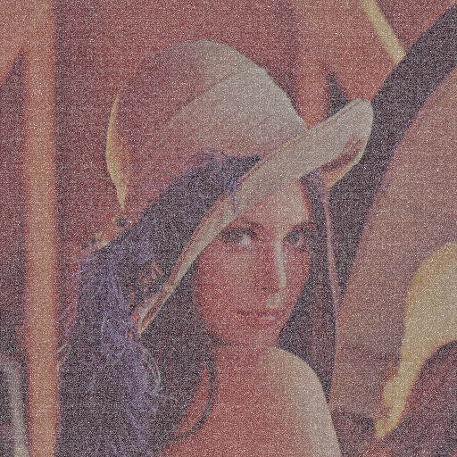
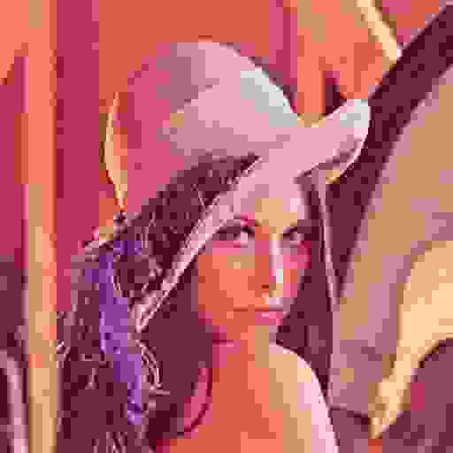
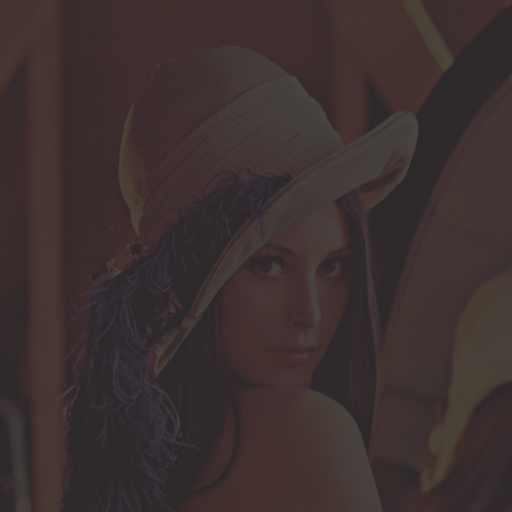

## Зачем нужна фильтрация изображений?

**Изображения часто содержат:**
- шум
- артефакты сжатия (например, jpeg)
- мелкие детали / размытые изображения
- изображения с плохим освещением

Перед выполнением задач компьютерного зрения необходим препроцессинг для изображений, т.к. практически все алгоритмы компьютерного зрения начинают работу с предварительной обработки изображения. Большинство классических методов основано на операции свертки

**Основные задачи фильтрации:**
- Подавление шума
- Выделение границ / структур / текстур
- Усиление деталей (повышение резкости изображения)
- Подготовка признаков (для последующего анализа алгоритмами CV: сегментация / распознавание)

---

## Примеры того, что изображения могут содержать

  
  
  
  

  
 шум

  
 артефакты сжатия

  
 размытость

  
 плохое освещение

---

## Понятие свертки

 

Свертка представляет собой преобразование изображения, при котором новое значение пикселя вычисляется на основе его соседей

На изображение накладывается небольшая матрица коэффициентов - **ядро свертки (kernel)**

 

**Для каждого положения:**
 - коэффициенты ядра умножаются на соответствующие значения пикселей
 - результаты суммируются
 - полученная сумма становится новым значением центрального пикселя

---

## Математическое определение

 

Для дискретного двумерного изображения:

$$g(x,y)=I(x,y)*K(x,y)$$

где:
$I(x,y)$ — исходное изображение; $K(x,y)$ — ядро свертки; $g(x,y)$ — результат свертки

 

Полная формула:

$$
g(x,y)=
\sum_{i=-a}^{a}
\sum_{j=-b}^{b}
I(x-i,y-j)K(i,j)
$$

где: $(2a+1)$ - ширина ядра; $(2b+1)$ - высота ядра

---

## Ядра свертки | Что такое ядро?

 

Ядро - небольшая матрица коэффициентов, задающая преобразование изображения

 

**Типичные размеры:**
- $3\times3$
- $5\times5$
- $7\times7$

Пример ядра повышения резкости:

$$
K=
\begin{bmatrix}
0 & -1 & 0\\
-1 & 5 & -1\\
0 & -1 & 0
\end{bmatrix}
$$

---

## Ядра свертки | Пример вычисления

 

Фрагмент изображения:

$$
I=
\begin{bmatrix}
100&110&120\\
90&100&130\\
80&100&120
\end{bmatrix}
$$

Ядро усреднения:

$$
K=
\frac{1}{9}
\begin{bmatrix}
1&1&1\\
1&1&1\\
1&1&1
\end{bmatrix}
$$

Результат:

$$
g=
\frac{(100+110+120+90+100+130+80+100+120)}{9}
=
\frac{950}{9}
\approx105.6
$$

---

## Обработка границ

 

Для пикселей на границе изображения отсутствуют соседи

 

**Наиболее распространённые подходы:**

- **Zero Padding** - дополнение изображения нулями, пиксели за пределами изображения равны 0
- **Replication Padding** - копирование крайних значений, "растягиваем" крайний пиксель бесконечно за пределы изображения
- **Reflection Padding** - Изображение отражается относительно границы (зеркалирование)
- **Circular Padding** - циклическое продолжение изображения, изображение считается периодическим. То, что ушло справа, появляется слева

---

## Обработка границ

| Метод | Плюсы | Минусы |
| --- | --- | --- |
| **Zero Padding** | Самый простой математически. Легко реализовать | Создает искусственный градиент на краях. Edge detecting'а (Собеля) увидит резкий перепад от реального пикселя к нулю - ложные яркие линии по периметру |
| **Replication Padding** | Нет резкого перепада в ноль. Градиент на границе сглажен | Если на краю изображения шумный пиксель, он размножится |
| **Reflection Padding** | Сохраняет статистику яркости и градиентов лучше, чем нули. Не создает ложных краев | Может создать иллюзию симметрии, которой нет |
| **Circular Padding** | Идеально для математики | Абсолютно нефизично для реальных фото. Если слева небо, а справа трава, при свертке они смешаются |

---

## Обработка границ | Пример

 

Представьте, что у вас одномерный сигнал: $[10, 20, 30]$, ядро $[1, 1, 1]$ (суммирование)

| Метод | Дополненный сигнал | Результат свертки (без нарощенных краев) |
| --- | --- | --- |
| Zero | [**0**, 10, 20, 30, **0**] | [0+10+20, 10+20+30, 20+30+0]  [30, 60, 50] |
| Replicate | [**10**, 10, 20, 30, **30**] | [10+10+20, 10+20+30, 20+30+30]  [40, 60, 80] |
| Reflect | [**20**, 10, 20, 30, **20**] | [20+10+20, 20+10+20, 20+30+20]  [50, 60, 70] |

---

## Усредняющий фильтр

 

Ядро:

$$
\frac{1}{9}
\begin{bmatrix}
1&1&1\\
1&1&1\\
1&1&1
\end{bmatrix}
$$

**Особенности:**
- эффективно подавляет шум
- размывает детали
- прост в реализации

---

## Гауссов фильтр

 

Проблема усредняющего фильтра - этот фильтр считает всех соседей одинаково важными

Функция Гаусса:

$$
G(x,y)=
\frac{1}{2\pi\sigma^2}
e^{-\frac{x^2+y^2}{2\sigma^2}}
$$

, где $\sigma$ контролирует степень размытия

 

Пример ядра:

$$
\frac{1}{16}
\begin{bmatrix}
1&2&1\\
2&4&2\\
1&2&1
\end{bmatrix}
$$

---

## Гауссов фильтр

 

**Особенности Гауссова фильтра:**
- Изотропность. Размывает изображение одинаково - что по горизонтали, что по вертикали, что по диагонали
- Отсутствие выраженных артефактов. Изображение получается мягким и плавным, потому что веса пикселей убывают постепенно, а не обрываются резко
- Хорошее подавление высокочастотного шума. Гауссов фильтр отлично «съедает» мелкий, зернистый шум - тот самый, который выглядит как рябь на фотографии
- Связь с теорией масштабного пространства. Фильтр, который при последовательном применении с разными радиусами ведёт себя математически корректно: размытие с одним радиусом, а потом с другим даёт тот же результат, что и сразу с суммарным радиусом

---

## Производные изображение

**Производные позволяют находить:**
- границы объектов
- резкие изменения яркости
- структурные особенности изображения

 

## Градиент изображения

Градиент определяется как:

$$
\nabla I=
\left(
\frac{\partial I}{\partial x},
\frac{\partial I}{\partial y}
\right)
$$

Модуль градиента:

$$
|\nabla I|=
\sqrt{I_x^2+I_y^2}
$$

Чем больше значение градиента, тем вероятнее наличие границы объекта.

---

## Частотная интерпретация

 

Любое изображение можно представить как сумму пространственных частот

**Низкие частоты содержат:**
- фон
- плавные переходы яркости
- крупные объекты

 

**Высокие частоты содержат:**
- контуры
- текстуры
- шум
- мелкие детали

---

## Частотная интерпретация

 

Низкочастотные фильтры пропускают низкие частоты и подавляют высокие. Как результат - размытие изображения

**Примеры:**
- Average Filter
- Gaussian Filter

 

Высокочастотные фильтры подавляют низкие частоты и усиливают высокие. Как результат - выделение деталей и границ

**Примеры:**
- Sobel
- Laplacian
- Sharpen Filter

---

## Связь со сверточными нейронными сетями

 

В сверточных нейронных сетях используется тот же математический аппарат

Различие состоит в том, что:

**Классическая обработка изображений**
- ядра задаются вручную
- параметры фиксированы

**CNN**
- коэффициенты ядра обучаются автоматически
- значения оптимизируются по функции потерь
